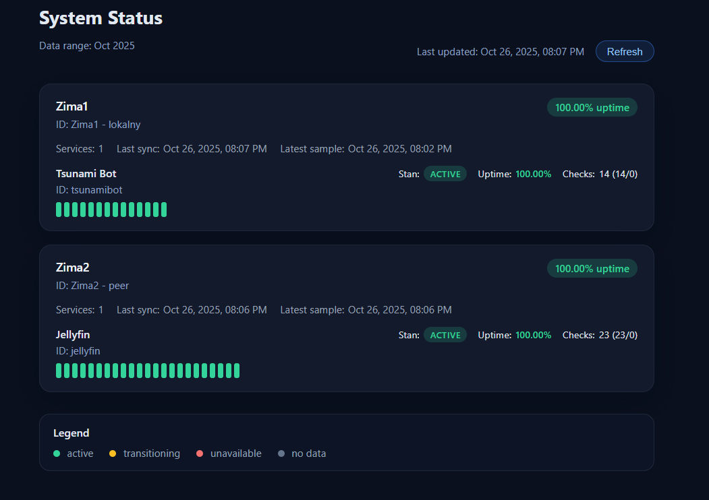

# JobMonitor

JobMonitor is a lightweight Go service that watches selected systemd units, stores their status history in JSON, and exposes a status-page style dashboard. Each instance can also pull data from other JobMonitor nodes so you can observe multiple servers from one place.



## Features
- Periodic `systemctl is-active` checks (with optional `sudo` on a per-target basis).
- Optional connectivity probe that pings a configurable DNS resolver and surfaces the status on the dashboard.
- JSON history stored at `.dist/data/status_history.json` (UTC timestamp plus result for every service).
- REST endpoints for local node data (`/api/node/status`, `/api/node/history`, `/api/node/uptime`) and a combined `/api/cluster`.
- Modern dark UI at `http://localhost:8080` with cards, sparkline-style timelines, and an incident list. Default view covers the last 24 hours with a one-click toggle for a 30-day history, and missed samples count towards downtime.
- Peer aggregation: every node can fetch snapshots from other JobMonitor instances.

## Configuration
Create a `config.yaml` alongside the binary. Example for two servers:

```yaml
interval_minutes: 5
data_directory: .dist/data
node_id: node-a
node_name: Server A
peer_refresh_seconds: 60
monitor_dns:
  enabled: true
  target: 1.1.1.1
  interval_seconds: 60
  timeout_seconds: 4
targets:
  - id: tsunamibot
    name: Tsunami Bot
    service: tsunamibot.service
    timeout_seconds: 8
  - id: nginx
    name: Reverse Proxy
    service: nginx.service
peers:
  - id: node-b
    name: Server B
    base_url: http://192.168.55.120:8080
    enabled: true
    # api_key: optional if you protect remote endpoints
```

Key notes:
- `node_id` must be unique across the cluster; by default the hostname is used.
- Set `use_sudo: true` on a target if `systemctl` requires elevated privileges (ensure sudoers is configured to avoid password prompts).
- Peers are optional; leave the list empty for a single-node setup.
- Enable the DNS probe by setting `monitor_dns.enabled: true`. The probe opens a TCP connection to the configured resolver (default Cloudflare `1.1.1.1:53`) every `interval_seconds` and displays the latency or error on the dashboard.

## Running
```powershell
go build ./cmd/jobmonitor
./jobmonitor.exe -config config.yaml -addr :8080
```

- The first sample is recorded immediately, subsequent ones follow `interval_minutes`.
- At startup the log reports how many services were loaded along with the node identifier.
- Peer sync runs in the background and refreshes every `peer_refresh_seconds`.

## API surface
- `/api/status`, `/api/history`, `/api/uptime` - legacy local endpoints kept for compatibility.
- `/api/node/status` - latest snapshot metadata for the current node.
- `/api/node/history?range=24h|30d` - filtered history window for the current node.
- `/api/node/uptime?range=24h|30d` - uptime calculations that treat missing samples as downtime.
- `/api/cluster?range=24h|30d` - aggregated snapshot combining the local node with all reachable peers (used by the UI).

## Sample history entry
```json
{
  "timestamp": "2025-10-26T15:00:00Z",
  "checks": [
    { "id": "tsunamibot", "name": "Tsunami Bot", "ok": true, "state": "active" },
    { "id": "nginx", "name": "Reverse Proxy", "ok": false, "state": "inactive", "error": "inactive" }
  ]
}
```

`state` mirrors the output of `systemctl is-active`. The `ok` flag is `true` only when the state is `active`, and `error` contains stderr/stdout details when the command fails.

## Operational tips
- Run on a Linux host with systemd; on other platforms `systemctl` is unavailable.
- To reset history, stop the service and delete `.dist/data/status_history.json`; the file will be recreated at next start.
- If you secure the API with tokens, add the same `api_key` value to each peer entry.
- The incident list in the UI highlights failing services and communication issues with peers for quick triage.
